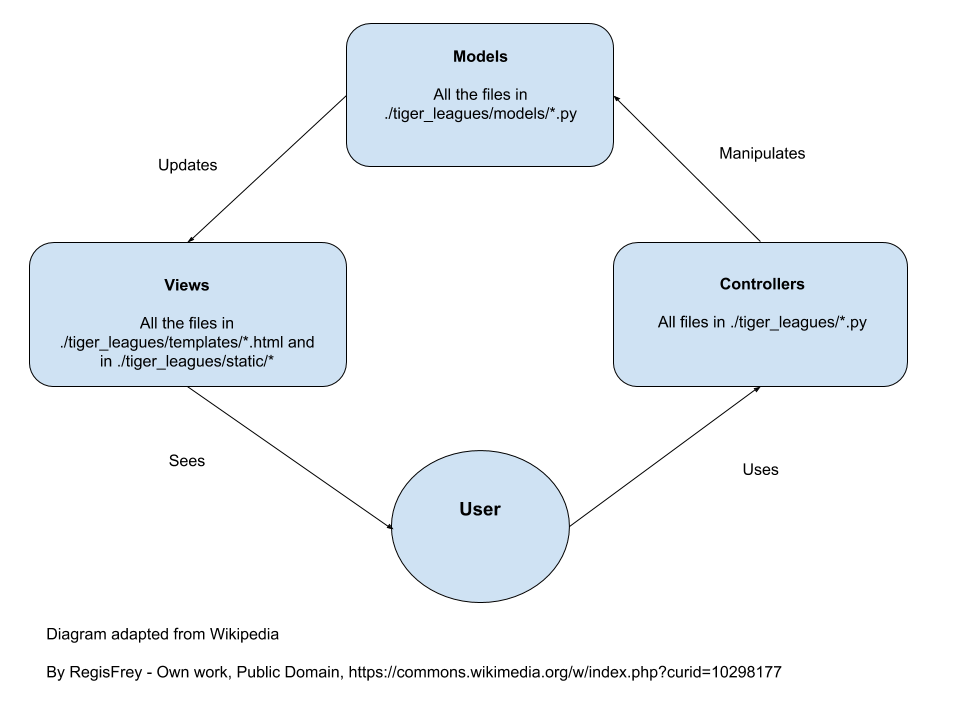

.. _tiger_leagues_overview:

.. image:: https://travis-ci.com/dchege711/cos333_tiger_leagues.svg?token=s3ipyzJyrRRfLAX2nLGG&branch=master
  :target: https://travis-ci.com/dchege711/cos333_tiger_leagues

**********************
App Overview
**********************

Tiger Leagues is a web application hosted at https://tiger-leagues.herokuapp.com/.
It is used by Princeton students that wish to run a league amongst themselves.
The application was created in lieu of managing leagues over Google Docs.
Features include:

* Creating leagues and registering members
* Scheduling league games
* Keeping track of scores and leaderboards

.. _components:

Components
----------

.. image:: ./img/tiger_leagues_components.png

.. _getting_started:

Getting Started
---------------

Clone the repository with::

  $ git clone https://github.com/dchege711/cos333_tiger_leagues.git
  $ cd cos333_tiger_leagues

Install the python packages (preferably in a new virtual environment)::

  $ pip install requirements.txt

We modelled the application after this `flask tutorial
<http://flask.pocoo.org/docs/1.0/tutorial/>`_.
Installing Flask usually installs ``ItsDangerous v1.0.0`` as a prerequisite.
However, Heroku cannot install v1.0.0. For this reason, ``./requirements.txt``
was manually updated to have ``ItsDangerous==0.24``.

We're using a locally hosted database for development purposes.
We found this `tutorial
<https://www.codementor.io/engineerapart/getting-started-with-postgresql-on-mac-osx-are8jcopb>`_
useful when setting up PostgreSQL.

Set the values of the environment variables defined in config.py_.

.. _config.py: tiger_leagues/readme.html#module-tiger_leagues.config

Run the application server::

  $ ./run_flask_server

.. _architecture:

Architecture
------------

Tiger Leagues uses the `Model-View-Controller 
<https://en.wikipedia.org/wiki/Model%E2%80%93view%E2%80%93controller>`_ 
architectural pattern.

For more detailed documentation and design decisions made at each level see:

* `Models <tiger_leagues/models/readme.html>`_
* `Views <tiger_leagues/models/readme.html>`_
* `Controllers <tiger_leagues/readme.html>`_

.. _testing:

Testing
-------

The tests are defined in the ``tests`` folder at the root of the project. We're 
using `pytest <https://docs.pytest.org/en/latest/>`_ for our testing. We have 
included a helper bash script (``run_tests``) to run the tests and provide 
coverage analysis.

We have also set up Travis CI to test entire builds. The Travis CI 
configuration is defined in the ``.travis.yml`` file at the root. We have set 
up ``origin/master`` as a protected branch, so make sure Travis CI greenlights 
any pull requests.

For UI tests, we don't yet have automated testing. However, we do have a 
simulator script in ``./dev_scripts/simulate_tiger_leagues.py``. This file is 
useful for simulating the application by generating fake data.

.. _generating_the_documentation:

Generating the Documentation
----------------------------

The documentation for this project is modelled after `Matplotlib's Tutorial
<https://matplotlib.org/sampledoc/index.html>`_ which generates documentation 
with `Sphinx <http://www.sphinx-doc.org/en/master/>`_.

``conf.py`` sets up the settings used by Sphinx. The docs are built from the 
.md and .rst files found within this repository.

You generally need to run ``$ make html`` to build the documentation. The docs
are built inside the ``docs`` folder, so that GitHub Pages can access them and 
serve them at https://dchege711.github.io/cos333_tiger_leagues

.. _additional_feature_requests:

Additional Feature Requests
---------------------------

The following are remarks made by users. In case you're looking for features to
implement, this is it Chief!

* You should add a feature to upload and share pictures and videos of the
  match to brag.
* We can have a puskas award (most beautiful goal) for the league at the end of
  the tourney
* In-depth stats, highlights, something to track playoff probability/scenarios
  toward the end would be pretty cool.
* Also a schedule for all the games.
* We can watch other ppl’s matches right? Would be cool to have an audience
